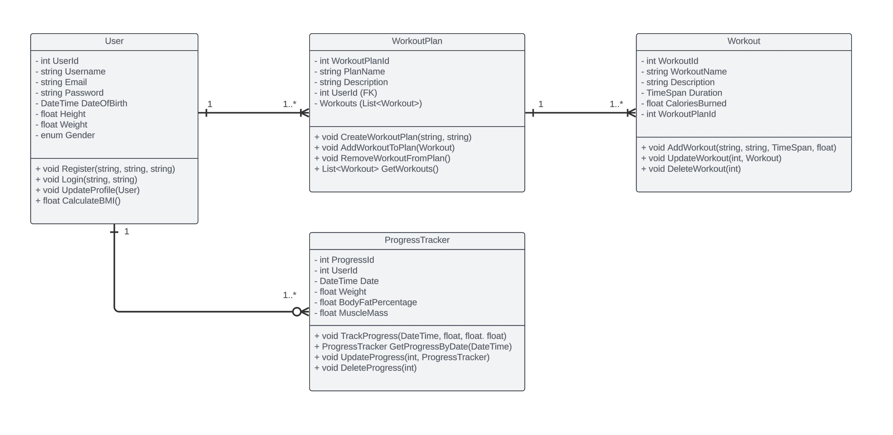

# FitApp
 Group project - web application development and testing
# Project Setup Instructions

## Pulling and Running the Project on a New Computer

When pulling the project repository to a new computer, follow these steps to ensure that all functions, including registration, login, and CRUD operations, work correctly.

### 1. Version Control (Git) Setup

- **Ensure All Files Are Committed and Pushed**: Before pulling the repository to another computer, make sure that all files are committed and pushed to your remote repository. This includes:
  - `Controllers`
  - `Views`
  - `Models`
  - `wwwroot` (CSS, JavaScript, images)
  - `appsettings.json`
  - `Program.cs` and `Startup.cs` (if using .NET Core 3.x or earlier)
  - `.gitignore` (to avoid committing unnecessary files)

### 2. Pulling the Repository

- **Clone or Pull the Repository**: On the new computer, clone the repository or pull the latest changes from the remote repository.

  ```bash
  git clone <repository-url>

### 3. Restore Dependencies

- **Install .NET SDK**: Ensure that the .NET SDK version used in your project is installed on the new computer. You can check the required SDK version in your `.csproj` file.
  
- **Restore NuGet Packages**: Run the following command to restore NuGet packages that your project depends on:

  ```bash
  dotnet restore

### 4. Database Configuration

- **Connection String**: Check the connection string in `appsettings.json`. Ensure it points to the correct database on the new machine.

  ```json
  "ConnectionStrings": {
      "DefaultConnection": "Server=(localdb)\\mssqllocaldb;Database=FitAppDb;Trusted_Connection=True;MultipleActiveResultSets=true"
  }

### 5. Testing the Application

- **Run the Application**: Start the application and test all major functionalities:
  
  - Registration and Login
  - CRUD operations for workouts
  - Navigation between pages
  - Database interactions

  ```bash
  dotnet run

 
## Class Diagram


